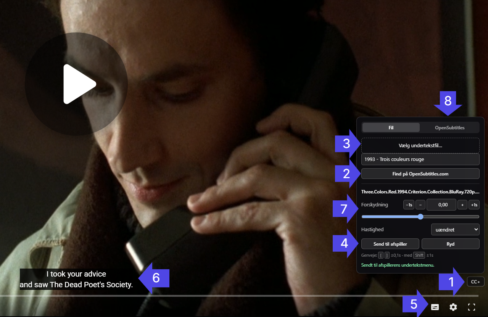
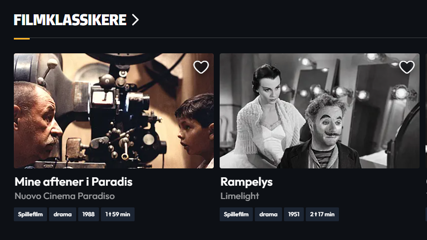
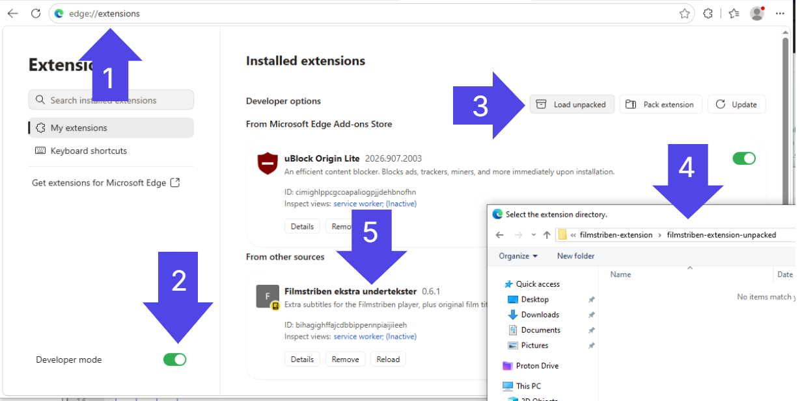

# Filmstriben Subtitle Tools

A Manifest V3 browser extension for [Filmstriben Fjernleje](https://fjernleje.filmstriben.dk/),
the Danish public-library film rental service. It adds support for custom subtitles so you can add languages the service does not
offer, and shows each film's original title in the catalogue.

Runs on Chromium browsers — Chrome, Edge, Brave, Vivaldi, Opera.

> **Notice.** This extension only ever reads and adds
> *text tracks*. It does not touch the CDM, the licence request, or the media segments, and it
> contains nothing that would help you do so. It is for adding subtitles to films you have
> legitimately borrowed from the library. Subtitles on the platform are unencrypted WebVTT served over CORS-open HTTPS,
> entirely separate from the Widevine/PlayReady path. 
> 
> Not affiliated with, endorsed by, or supported by DBC, Filmstriben, Norgesfilm or
> OpenSubtitles. Names are used only to describe what the extension interoperates with.

## Features / Usage

### Player - Custom Subtitles

Add custom subtitles to any movie.

1. **CC+ button** — bottom-right above the seek bar, fading in and out with the player's own controls.
2. **Open an OpenSubtitles.com web search** — pre-filled with `<year> - <original title>`, in an editable field so you can correct it first.
3. **Load a subtitle file** — `.srt`, `.vtt`, `.ass`, `.ssa`. Encoding is sniffed (UTF-8, falling back to Windows-1252) so Latin-1 Nordic files don't come out as mojibake.
4. **Send to the player** — bakes the timing into a real Shaka track so it appears in the native subtitle menu and works when casting. Later timing changes re-send automatically.
5. **Added to native subtitle menu** - subtitle is loaded by the player's native menu and selected automatically.
6. **Subtitles in action** - subtitles shown in the player.
7. **Live timing adjustment** — slider, ±0.1 s / ±1 s nudges, `[` and `]` shortcuts, plus frame-rate presets (23.976 ↔ 25 fps) for subtitles that drift. Changes apply on the next frame.
8. **Auto fetch subtitle from OpenSubtitles (untested)** — Auto searches for subs. Select a results for one click download and loading. Requires OpenSubtitles API key, see [OpenSubtitles API setup](#opensubtitles-api-setup)



### Film Catalogue - Original Titles

Original titles are shown as a small faded line under the translated title, on cards and page headings. May not be supported on sibling services e.g. filmoteket.no.



## Install

The extension is not on any extension store. You must load it unpacked/unzipped. The steps are identical in every supported
browser; only the address of the extensions page differs.

0. Clone or download this repository. Put it somewhere permanent e.g. Documents — the browser reads these
   files at every start, so it will break if you leave it in Downloads and delete the folder later.
1. Open your browser's extensions page:

   | Browser | Address | Developer mode toggle |
   |---|---|---|
   | Edge | `edge://extensions` | bottom-left |
   | Chrome | `chrome://extensions` | top-right |
   | Brave | `brave://extensions` | top-right |
   | Vivaldi | `vivaldi://extensions` | top-right |
   | Opera | `opera://extensions` | top-right |
2. Enable **Developer mode**:
3. Click **Load unpacked**
4. Select the `filmstriben-extension-unpacked` folder which contains `manifest.json`. If the browser says it cannot find a manifest, you picked the wrong folder.



### Per-browser notes

- **Brave** — Widevine is a prompted download on first use. If playback itself does not start,
  accept that prompt; it is unrelated to this extension. Shields do not need disabling.
- **Opera** — has its own sidebar extension manager, but `opera://extensions` is still the page
  that offers *Load unpacked*.
- **All** — after editing any file, return to the extensions page and click the reload arrow on
  the extension card, *then* hard-reload the site. Reloading only the page keeps the old copy.
- Developer-mode extensions live in one browser profile, and some browsers re-prompt about
  them on restart. Choose *Keep* — dismissing the other way disables the extension.


### Sibling services

The Filmstriben player is built by **Norgesfilm AS**, who run the same stack
for public-library film services:

| Service | Country | Operator |
|---|---|---|
| [fjernleje.filmstriben.dk](https://fjernleje.filmstriben.dk/) | 🇩🇰 | DBC — **the one this is developed against** |
| [biblioteket.filmstriben.dk](https://biblioteket.filmstriben.dk/) | 🇩🇰 | DBC — the on-site library portal |
| [filmoteket.no](https://filmoteket.no/) | 🇳🇴 | Norgesfilm |
| [filmbib.no](https://filmbib.no/) | 🇳🇴 | Norgesfilm |

The subtitle feature has a good chance of working on any of the above, as the player integration depends on the shared
Shaka Player being exposed as `window.shakaplayer` by Norgesfilm's `shaz.std.js` wrapper, and on subtitles being served as
plain WebVTT. Both are properties of the shared platform, so 

**Untested:** Getting there means adding the relevant hosts to the
`matches` patterns in `manifest.json` and checking `window.shakaplayer` exists in the player
frame. The catalogue half — original titles — is tied to Filmstriben's GraphQL schema and
would need separate work. See [Porting to a sibling service](#porting-to-a-sibling-service).

---

### OpenSubtitles API setup

Only needed for in-player search and download; everything else works without it.

1. Register at [opensubtitles.com](https://www.opensubtitles.com/).
2. Profile → **Consumers** → create an application → copy the API key.
3. Right-click the extension → **Options** → paste the key → **Gem**.

Adding your username and password is optional. Without them you get the small anonymous
download quota; with them, your account's. They are stored in `chrome.storage.local` and used
only to obtain a JWT, which is refreshed automatically on a 401.

---

## Browser support

Two manifest features decide this: `content_scripts[].world: "MAIN"`, without which the
extension cannot reach `window.shakaplayer`, and `background.service_worker`, which is where
the OpenSubtitles calls run.

| Browser | Works | Why |
|---|---|---|
| **Chrome 111+** | ✅ | `world` support lands in 111 |
| **Edge 111+** | ✅ | mirrors Chrome; the reference platform |
| **Brave, Vivaldi, Opera** | ✅ | same engine — need a Chromium 111 or newer base |
| **Firefox** | ❌ | `background.service_worker` is **not implemented** (`version_added: false`) |
| **Safari** | ⚠️ | APIs are there from Safari 18, but it cannot load unpacked folders |

Version data from [MDN browser-compat-data](https://github.com/mdn/browser-compat-data):
[`content_scripts`](https://raw.githubusercontent.com/mdn/browser-compat-data/main/webextensions/manifest/content_scripts.json),
[`background`](https://raw.githubusercontent.com/mdn/browser-compat-data/main/webextensions/manifest/background.json).

### Firefox

Support is close, but not a drop-in. Firefox 128 *does* support `world: "MAIN"`, so
the hard part is already solved. What blocks it is the background script: Firefox has never
implemented `background.service_worker` and uses non-persistent `background.scripts` instead.

Porting it would mean, at minimum:

- Declaring both background forms so each browser picks the one it understands —
  `"background": { "service_worker": "sw.js", "scripts": ["sw.js"] }`.
- Adding `browser_specific_settings.gecko.id`.
- Auditing `sw.js` for `chrome.*` promise semantics, which differ from Firefox's `browser.*`.
- Handling Firefox MV3 host permissions, which are user-granted at runtime rather than
  granted on install — so the OpenSubtitles calls can be refused until the user opts in.

Untested. If you do it, please open a PR.

### Safari

Safari 18 supports both required features, so the code could run. The obstacle is
distribution: Safari has no *Load unpacked*. An extension must be wrapped in a macOS app
bundle via `xcrun safari-web-extension-converter` and signed, which needs Xcode and an Apple
developer account. Out of scope here, but not impossible.

---

## Porting to a sibling service

The subtitle feature is not really Filmstriben-specific — it is
Norgesfilm-specific, and Norgesfilm runs several services. To try it against one:

1. **Find the player host.** Play something and watch the network panel for a request to
   `player.norgesfilm.no/shaka/<version>/shaka-player.ui.js`. If it is there, the platform
   matches. Note the page hosting the player — Filmstriben uses
   `streaming.filmstriben.dk/play/<ticket>` in an iframe.
2. **Confirm the global.** In the player frame's console, `window.shakaplayer` should be a
   Shaka `Player` instance. That single check is the whole compatibility question for the
   player features.
3. **Add match patterns** for that host to the `player.js` and `bridge.js` entries in
   `manifest.json`, keeping `all_frames: true` and `world: "MAIN"` on `player.js`.
4. **Check the subtitle URLs.** They should sit next to the DASH manifest as
   `sub-<lang>.vtt`, served with `Access-Control-Allow-Origin: *`.

The catalogue features are a different matter. Original titles come from Filmstriben's own
GraphQL schema (`fields.originalTitle` via `GetContent`), and the Norwegian services are
unlikely to expose the same operations. Treat `catalogue-net.js` as Filmstriben-only unless
you re-derive the schema from a HAR capture of that site.

---

## The service's architecture

This is the part worth reading if you are picking the project up. Everything below was derived
from HAR captures of ordinary browsing sessions.

```
fjernleje.filmstriben.dk                      Next.js + Apollo Client 4
  │
  ├── POST api.filmstriben.dk/fil/graphql     all catalogue + entitlement data
  │
  └── <iframe> streaming.filmstriben.dk/play/<ticket>      ASP.NET / Kestrel
        │
        ├── js/apiplayer.js        multi-backend shim (Shaka / Bitmovin / THEOplayer)
        ├── player.norgesfilm.no/shaka/<ver>/shaka-player.ui.js
        ├── player.norgesfilm.no/shaz/<ver>/shaz.std.js     vendor wrapper
        │
        ├── <cdn>/s/dbc/<asset>/manifest.mpd               DASH
        │     ├── video-1/v1-*.m4s      encrypted
        │     ├── audio-<lang>/a1-*.m4s encrypted
        │     └── sub-<lang>.vtt        PLAIN TEXT, CORS *, not encrypted
        │
        ├── <axinom-host>/AcquireLicense?AxDrmMessage=<jwt> Widevine + PlayReady
        └── POST /updateplayprogress   multipart {ticket, time}, every ~15s
```

### Key facts

| | |
|---|---|
| **Operator** | DBC Digital A/S (Dansk BiblioteksCenter) |
| **Player platform** | Norgesfilm AS — the Android package is `no.norgesfilm.dbcplayer`, and the player is served from `player.norgesfilm.no`. Their Norwegian siblings (filmoteket.no, filmbib.no) appear to run the same stack and are useful for cross-referencing. |
| **Player** | Shaka Player 5.x, wrapped by Norgesfilm's `shaz.std.js` |
| **The crucial detail** | That wrapper does `window.shakaplayer = player; window.shakaui = ui;` — the player instance is a plain global. No constructor hooking needed. |
| **Text rendering** | The wrapper configures `shaka.text.UITextDisplayer`, so Shaka renders subtitles into its own DOM overlay rather than native `<track>` elements. |
| **DRM** | Axinom, Widevine + PlayReady |
| **Subtitles** | `sub-<lang>.vtt` next to the manifest, `Content-Type: text/vtt`, `Access-Control-Allow-Origin: *`, cached a year. **Not** covered by the DRM. |

### GraphQL operations

One endpoint, `POST api.filmstriben.dk/fil/graphql`. Operations observed:

| Operation | Returns |
|---|---|
| `GetContent(portal, recordIds)` | `movies[].{recordId, agency, type, fields{...}, taxonomy{...}}` |
| `GetContextedList(portal, listId, contextRecordId, sorting, facets)` | a carousel/list → `elements[].recordId` |
| `GetUserRecommenedMovies(token, ...)` | same shape, personalised (note the upstream typo) |
| `GetCommonUserInformation(token)` | `user.points.{month,week,totalMonth,totalYear}.{value,quota,text}` |
| `RestoreMovieRent(recordId, token, portal)` | `movie.moviePlaylist` — the entitlement blob handed to the player |
| `Authentication`, `fetchGlobalNotificaiton`, `fetchRecommendations` | as named (second typo is theirs too) |

`GetContent`'s `fields` selection is the richest thing on the site:

```
poster  originalTitle  primaryTitle  primaryImage  primaryDescription  primaryColor
url  year  lengthHours  lengthMinutes  ageRestriction  faustNumber  movieTeaser  points
```

Two id namespaces coexist and are easy to confuse:

- `recordId` — integer, used by GraphQL (`22426`, `18964`).
- the route id — long numeric, used in URLs: `/film/9000006957/vejen-hjem`.

`fields.url` is the bridge between them. The extension keys its index off the numeric segment
of that URL, falling back to `recordId`.

> ⚠️ **All field knowledge above comes from the GraphQL *queries* in captured requests.** The
> HAR exports used during development contained no response bodies, so response *shapes* are
> inferred from the query selections and have not been verified against real payloads. If
> something does not line up, capture a HAR with response content enabled and check.

### How the captures were made

DevTools → Network → **Preserve log** on, then browse or start playback, then *Export HAR*.
For anything involving response shapes, make sure the export includes content — the
"HAR (sanitized)" option strips bodies and cookies, which is what happened here.

---

## How the extension works

Four scripts across three execution contexts, because each has something the others lack.

```
 ┌─ catalogue (fjernleje.filmstriben.dk) ──────────────────────────────┐
 │  catalogue-net.js   MAIN world      patches fetch, reads GraphQL    │
 │        │ window.postMessage                                         │
 │  catalogue.js       isolated world  has chrome.runtime              │
 └────────┼────────────────────────────────────────────────────────────┘
          │ chrome.runtime
 ┌────────▼─────────────────────────────────────────────────────────────┐
 │  sw.js   service worker   OpenSubtitles API, credentials, film ctx   │
 └────────▲─────────────────────────────────────────────────────────────┘
          │ chrome.runtime
 ┌────────┼────────────────────────────────────────────────────────────┐
 │  bridge.js          isolated world  relay                           │
 │        │ window.postMessage                                         │
 │  player.js          MAIN world      reaches window.shakaplayer      │
 └─ player iframe (streaming.filmstriben.dk/play/*) ───────────────────┘
```

| File | Context | Role |
|---|---|---|
| `player.js` | MAIN, player iframe | cue parsing and rendering, timing, panel UI, commit to Shaka |
| `bridge.js` | isolated, player iframe | `postMessage` ↔ `chrome.runtime` relay |
| `catalogue-net.js` | MAIN, catalogue | fetch interception, film index, original-title subtitles |
| `catalogue.js` | isolated, catalogue | relays film context to the service worker |
| `sw.js` | service worker | OpenSubtitles REST calls, credential storage |
| `options.html` / `options.js` | — | API key and account |
| `panel.css` | player iframe | CC+ button, panel, cue layer |
| `catalogue.css` | catalogue | original-title subtitle |

### Why each context is needed

- **MAIN world** is the only place `window.shakaplayer` and the page's `fetch` are reachable.
  Isolated-world content scripts get a separate `window`.
- **MAIN world has no `chrome.*` APIs**, so anything needing storage or cross-origin network
  has to be relayed out. Hence `bridge.js` / `catalogue.js`.
- **The service worker** is the only context not subject to CORS. `api.opensubtitles.com`
  sends no CORS headers and will not answer a page-context `fetch` — a recurring complaint on
  their forum. With `host_permissions` for that origin, the worker is unaffected.
- The player runs in a **cross-origin iframe** (`Sec-Fetch-Dest: iframe`), so content scripts
  targeting it need `all_frames: true` and a match on `streaming.filmstriben.dk/play/*`.
  It cannot read the film title from its parent — hence the context relay.

### Subtitle timing

Loaded subtitles are rendered by the extension, not by Shaka: cues are parsed to
`[{start, end, text}]` once, and the render loop reads `offset` and `rate` every frame.
Effective time is `cue.start * rate + offset`. This is why adjustment is instant — nothing is
re-parsed or re-uploaded.

**Send til afspiller** bakes the current timing into a real Shaka track via
`addTextTrackAsync(blobUrl, lang, 'subtitle', 'text/vtt', …)`. Shaka registers `blob:` with
its networking engine alongside `http`/`https`, so a `Blob` URL is a valid track URI. After
committing, a timing change switches Shaka's stale track off, resumes local rendering for
immediate feedback, and re-sends after 600 ms of quiet.

Track labels in the player menu: the file name for a local file, `OS: <language>` for an
OpenSubtitles download.

---

## Gotchas worth knowing before you change things

- **Subtitle files are untrusted input.** Tags are stripped and cues are written with
  `textContent`, never `innerHTML`. Keep it that way.
- **Encoding.** Nordic subtitle files are often Windows-1252, not UTF-8. Everything
  decodes with `TextDecoder('utf-8', {fatal: true})` first and falls back on throw.
- **`User-Agent` cannot be set from `fetch`** in a service worker; Chrome forbids it. If
  OpenSubtitles ever rejects calls for that reason, a `declarativeNetRequest` header rule is
  the way around it.
- **DOM work must be idempotent.** The catalogue is React with carousels, lazy loading and SPA
  navigation, driven here by a `MutationObserver`. The title annotation reads a heading's *own*
  text nodes (`ownText()`), ignoring the subtitle element it injects, so a heading still matches
  on later passes and a re-render that wipes the annotation simply gets it back.
- **Watch `[class*="title"]` selectors.** The injected subtitle's own class matches them, which
  will recurse if you do not exclude it explicitly.
- **The film page's `<h1>` is not just the title.** It contains the runtime and a save button
  as child elements, so `h1.textContent` yields things like `"Rød1 time 35 minutterGemt"`.
  Read `ownText()` — direct text nodes only — and scrub as a fallback. This reached the
  OpenSubtitles search URL once already.
- **Scope source precedence to the page, never to a time window.** The film context has two
  sources: the GraphQL record (has the original title) and a DOM reading (only ever gets the
  Danish one). An early version let the DOM fallback resume after a ten-second quiet period,
  which meant that lingering on a film page — which everyone does, since they have to click
  play — silently downgraded a good record to the Danish title, and OpenSubtitles searches
  came back empty. Precedence is now keyed on `location.pathname` and enforced again in
  `sw.js`, where a `source: 'dom'` payload can never replace a `source: 'graphql'` one for
  the same URL.
- **OpenSubtitles indexes by original title.** Always prefer `originalTitle`; the Danish
  release title rarely matches anything in their database.
- **Two typos are upstream**, not yours: `fetchGlobalNotificaiton` and `GetUserRecommenedMovies`.

---

## Development

No build step. Edit a file, reload the extension on your browser's extensions page (see the
table under [Install](#install)), then hard-reload the site. Editing a content script alone is
not enough — the old copy stays cached until the extension itself is reloaded.

The logic is deliberately separated from the DOM so it can be tested under Node with `jsdom`:

```js
// pure helpers, exported for exactly this reason
__fsSubs.parseSubtitles(text)       // SRT / VTT / ASS → [{start, end, text}]
__fsSubs.toVtt(cues, offset, rate)
__fsSubs.osWebSearchUrl(title, yr)
__fsPoints._helpers.ownText(el)
__fsPoints.absorb(payload)          // feed a captured GraphQL response back in
```

### Console API

In the player iframe (select that frame in the DevTools console context dropdown):

```js
window.shakaplayer                  // the site's own Shaka instance
__fsSubs.track                      // { cues, offset, rate, lang, label, visible }
__fsSubs.track.offset = 2.5         // applies on the next frame
__fsSubs.assetBase()                // CDN base URL for the current film
```

On the catalogue:

```js
__fsPoints.index.byId               // route id → { title, originalTitle, year, recordId }
__fsPoints.index.swap               // danish title → original title
__fsPoints.refresh()                // re-run annotation + context report
```

### If something breaks

Most likely causes, in order:

1. **The site renamed or stopped exposing `window.shakaplayer`.** Hook `shaka.Player`
   construction at `document_start` instead, or wrap `MediaSource.prototype.addSourceBuffer`.
2. **Shaka major version bump** changed the text-track API. `addTextTrackAsync` and
   `selectTextTrack(track | null)` are the two calls that matter.
3. **Apollo switched from `fetch` to XHR**, silently breaking the catalogue interception.
   Patch `XMLHttpRequest.prototype.send` as well.
4. **GraphQL field renames.** Responses are matched structurally (`data.movies`, `data.movie`)
   rather than by operation name, specifically so renames and batching do not break it — but
   field names inside `fields` are still assumed.

